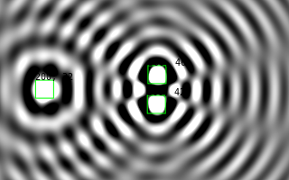
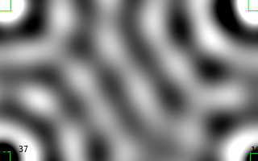
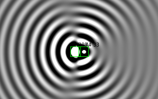
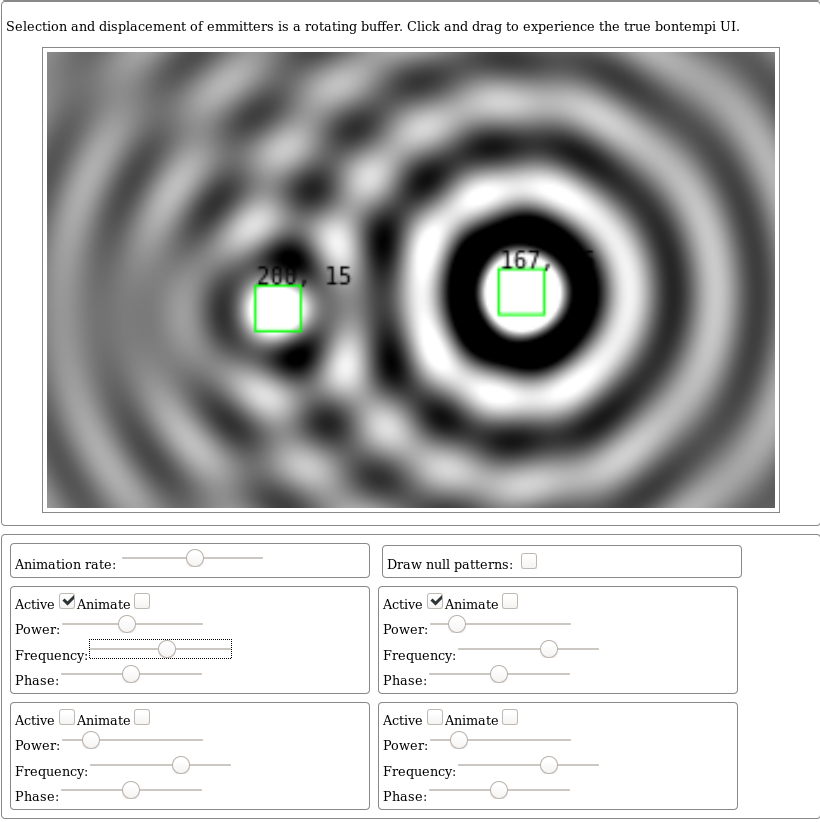

# interferencePatternJsToy

Simple and dirty JS toy which lets you play with interference patterns.

---

 [@tixlegeek](https://twitter.com/tixlegeek) - [tixlegeek.io](https://tixlegeek.io) - The twitter discussion following the dev: [Here](https://twitter.com/tixlegeek/status/1235567463636570112)

Copyright (c) 2020 Tixlegeek (MIT, see LICENSE ) - You can do whatever you want with that code.

---

## About the code

This code have been initiated on 05-03-2020. It has been coded in a jiffy. It's pure vanilla JS, without any dependency or hardware magic. 

## About Physics accuracy

This is not a physics-accurate simulation. The results are approximated following simple statements:

* Each emmitters have parameters that you can set:

  * Frequency
  * Phase
  * Amplitude (power)

  All those property are only quantitative.

* At each point of the graph, the signal is approximated using:
  $$
  \sum_{E=1}^{nE}sin{Ed_i\times Ef_i - Ep_i}\times \dfrac{1}{Ed_i\times Ea_i}
  $$
  ​	with:
  $$
  Edi = \sqrt{(x_i-Ex_i)^2+(y_i-Ey_i)^2)}
  $$
  

  These are bad mathematical transcription of the "sum of each  emitter's signal amplitude at given point ($$i$$)

  whatever, because, the code is so simple and dirty you could have found out yourself.

In some words: You cannot simulate refraction/diffraction/etc. It's mostly just a toy.

# About the UI

The UI is awful for now, but some people offered to try their magic on this thing. I only needed this for myself, and did not planned to share it, so i did not made any efforts about that.

HppHckng!